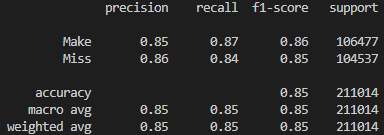
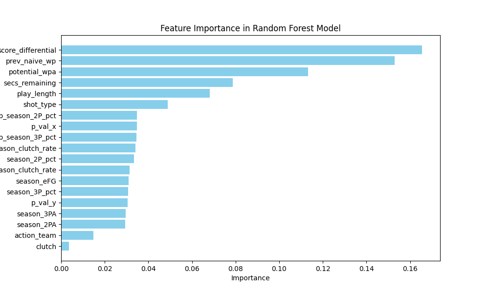

# Orange Hoops Data Science Challenge — Clutch Shooter Prediction

A machine learning project built for the Syracuse University Orange Hoops Data Science Challenge. Our team tackled a critical basketball question: **who should take the final shot in clutch situations?**

## Overview

We defined "clutch" as high-stakes moments in the last five minutes of a close game, then built a model to predict which player gives a team the best chance of converting under pressure.


## Approach

- Defined clutch situations using game state data — score differential and time remaining
- Used **Win Probability Added (WPA)** to evaluate shot importance and identify high-pressure moments
- Engineered features from real-time game conditions and individual player shooting statistics
- Built a **Random Forest classifier** using scikit-learn to predict shot success in clutch moments

## Model Performance



- **85% accuracy** across 211,000 shots
- 85% precision on both makes and misses
- Trained on play-by-play NCAA data with a 70/30 train-test split

## Feature Importance



## Key Findings — Syracuse University

**Maliq Brown** emerged as the top candidate for game-deciding two-point shots.


**Chris Bell** led the team in 3P% during clutch moments, excelling in high-pressure three-point scenarios.


## Tech Stack

- Python, scikit-learn (Random Forest classifier)
- R / RStudio (exploratory data analysis)
- Win Probability Added (WPA) as primary evaluation metric

## Project Structure

```
├── assets/                              # Screenshots and visuals
├── ScikitLearn Random Forest Model.py   # ML model and predictions
├── HoopsCompCode.R                      # Exploratory data analysis in R
└── README.md
```

## Team

- Jacob VonTersch — [@Tersch23](https://github.com/Tersch23)
- Evan Vassilovski — [@evanvassilovski](https://github.com/evanvassilovski)
- Jack A

*Syracuse University iSchool — November 2024*
